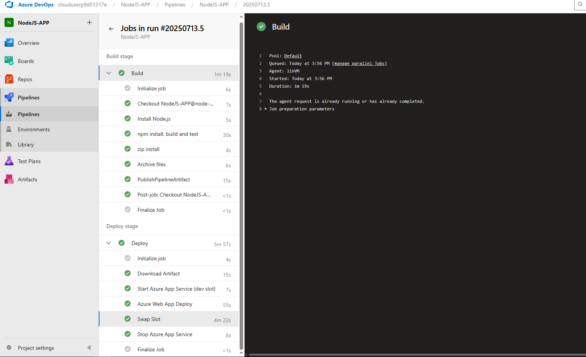
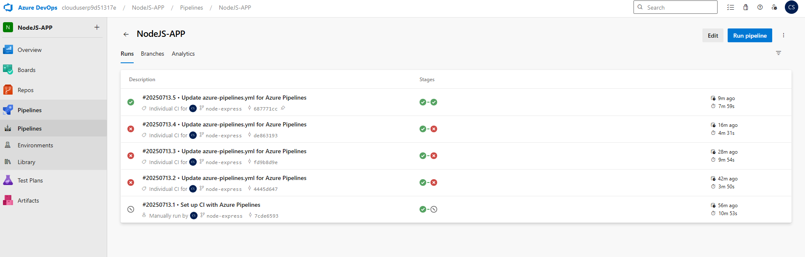
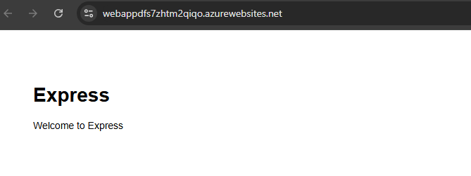

# Node.js Express App Deployment with Azure DevOps Pipeline

This project demonstrates how to build, deploy, and manage a **Node.js Express web application** on **Azure App Service (Linux)** using an **Azure DevOps Pipeline** with deployment slots for zero-downtime deployments.

---

## 📦 Project Overview

- **Framework:** Node.js Express  
- **Platform:** Azure App Service (Linux)  
- **CI/CD Tool:** Azure DevOps Pipelines  
- **Deployment Type:** ZIP Deploy with slot swapping (dev ➝ production)  
- **Agent:** Self-hosted Linux agent

---

## 📜 Features

- Automated build and archive of a Node.js Express application.
- Dynamic installation of Node.js runtime on the agent during pipeline execution.
- ZIP deployment to a **dev slot** on Azure App Service.
- Deployment slot swapping for zero-downtime production deployments.
- Retention of deployment history for rollback and audit.
- Seamless deployment via **self-hosted agents** for enhanced control.

---

## 🔧 Prerequisites

- Azure subscription  
- Azure App Service (Linux) with a production slot and a dev slot  
- Azure DevOps organization and project  
- Azure Service Connection in DevOps with **Contributor** role assigned  
- Self-hosted agent registered in your Azure DevOps organization  
- `zip` utility either pre-installed on the agent or dynamically installed via the pipeline  
- **No need to pre-install Node.js** — it is dynamically installed during the pipeline run using the `NodeTool` task

---

## 🚀 CI/CD Pipeline Overview

### 📌 Build Stage:
- Install Node.js 20.x on the agent using Azure DevOps `NodeTool` task.
- Install project dependencies via `npm install`.
- Build the application.
- Archive the application files into a `.zip` package.
- Publish the archive as a build artifact.

### 📌 Deploy Stage:
- Download the build artifact.
- Start the **dev slot** (if not already running).
- Deploy the ZIP package to the **dev slot** using the Azure Web App Deploy task.
- Swap the **dev slot** with **production** for zero-downtime production deployment.
- (Optional) Stop the **dev slot** post-swap to conserve resources.

---

## 📸 Screenshots

| CI/CD Pipeline Run | Successful Deployment | Live Application |
|:-----------------:|:---------------------|:----------------|
|  |  |  |

---

## 📌 Notes

- Ensure both **dev** and **production** slots are running before performing a swap — Azure requires active slots for swapping.
- Deployment history is automatically maintained for rollback and audit purposes.
- The **self-hosted agent** must have required permissions and a working Azure DevOps agent service.
- Adjust runtime stack in the App Service config to match the Node.js version you install via the pipeline.

---

## 📑 License

MIT License

---

## 🙌 Author

**Tanmay Choudhury**  
*Azure DevOps Enthusiast | DevOps Engineer in Progress*

---

## 📬 Contact

For feedback or questions:  
📧 [YourEmail@example.com]
